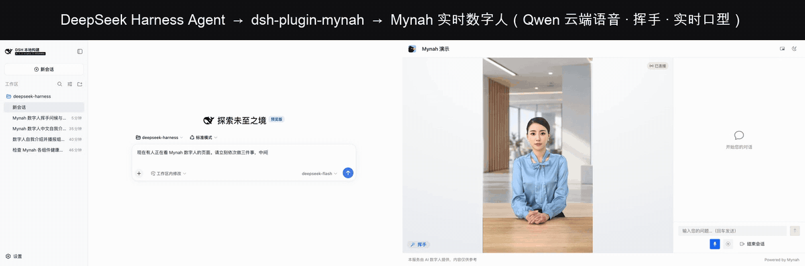

# dsh-plugin-mynah

给 [DeepSeek Harness](https://github.com/deepseek-ai/deepseek-harness) 的 Agent 一张会说话的脸。

这个插件让 dsh Agent 直接驱动 [Mynah](https://github.com/honwee/mynah) 实时数字人：对着屏幕前的人开口说话、打断、查看谁在线、列出已发布的频道、看健康状态、往知识库里塞资料。Mynah 是开源、可私有化部署的数字人全栈（WebRTC 唇形同步视频、管理控制台、频道发布、知识库，默认 EdgeTTS 免费语音，6GB 显卡或远端推理即可）。

```
Agent (DeepSeek Harness) ──mynah_speak──▶ Mynah cored ──WebRTC──▶ 浏览器里一张会说话的脸
```



<sub>左：DeepSeek Harness Web 界面，`deepseek-flash` 跑 Agent。右：Mynah 频道页。一句指令，Agent 依次调用 `mynah_sessions` → `mynah_speak` → `mynah_status` → `mynah_speak`，数字人把话说出来。 Full video: <a href="docs/agent-demo.mp4">docs/agent-demo.mp4</a>.</sub>


## 工具

| 工具 | 作用 | 需要管理员登录 |
|---|---|---|
| `mynah_speak` | 让数字人在某个在线会话里说 `text`。`type=echo` 原话播报（默认）；`type=chat` 交给 Mynah 自己的对话大脑回答。 | 否 |
| `mynah_interrupt` | 让数字人闭嘴。 | 否 |
| `mynah_sessions` | 列出在线会话（拿 session id 给 `mynah_speak` 用）。 | 是 |
| `mynah_channels` | 列出已发布频道和访客链接。 | 是 |
| `mynah_status` | 实时核心 / 数字人引擎 / ASR / TTS / 数据库健康状态。 | 是 |
| `mynah_kb_add` | 往知识库添加一篇文本/markdown 文档。 | 是 |

实时类工具只需要 session id，这是访客页本来就持有的凭证；管理类工具用控制台账号登录一次并缓存 JWT。

## 安装

```sh
dsh plugin --profile web add dsh-plugin-mynah      # 从 npm
# 或从本地检出：
dsh plugin --profile web add ./dsh-plugin-mynah
```

告诉它 Mynah 在哪。改 profile 的 `cordis.patch.yml`：

```yaml
- id: mynah
  name: dsh-plugin-mynah
  config:
    baseUrl: https://do.au56.com:8443      # 访客 / 实时端
    adminUrl: https://do.au56.com:9443     # 管理控制台
    username: admin
    password: ********
```

或者用环境变量（`MYNAH_URL`、`MYNAH_ADMIN_URL`、`MYNAH_USER`、`MYNAH_PASSWORD`，可选 `MYNAH_TOKEN`、`MYNAH_INSECURE_TLS=1`）。注意 patch 会整块替换 `config`，需要的键要写全。

```sh
dsh --profile web --dump-config | grep -A3 'id: mynah'
dsh --profile web
```

## 60 秒试一下

1. 打开一个 Mynah 频道页（例如 `https://<你的 Mynah>:8443/channel/test`），点 **开始对话**。
2. 在 dsh 里说：*"找到在线的 Mynah 会话，让数字人叫我的名字打个招呼。"*
3. Agent 先调 `mynah_sessions`，再调 `mynah_speak`，屏幕上的数字人就开口了。

无头模式，适合脚本和 CI：

```sh
dsh --profile headless "先用 mynah_sessions，然后让数字人说：今天的部署已经完成。"
```

## 开发

```sh
npm install
npm run build          # 按 npm 上的 @deepseek-ai 包编译
npm run check:local    # 对着旁边的 deepseek-harness 源码检出编译 + vitest（见 tsconfig.local.json）
```

`tests/cordis-integration.spec.ts` 会启动真实的 `@deepseek-ai/dsh-tools` 注册表，挂载本插件，对一个本地假 Mynah 跑通各工具。

## 要求

- DeepSeek Harness ≥ 0.1.2-alpha.5，Node ≥ 22.19
- 一个能访问的 Mynah 实例（Mynah 仓库里 `docker compose up -d`；默认 EdgeTTS，不用任何 key 就能听见它说话）

MIT © honwee
